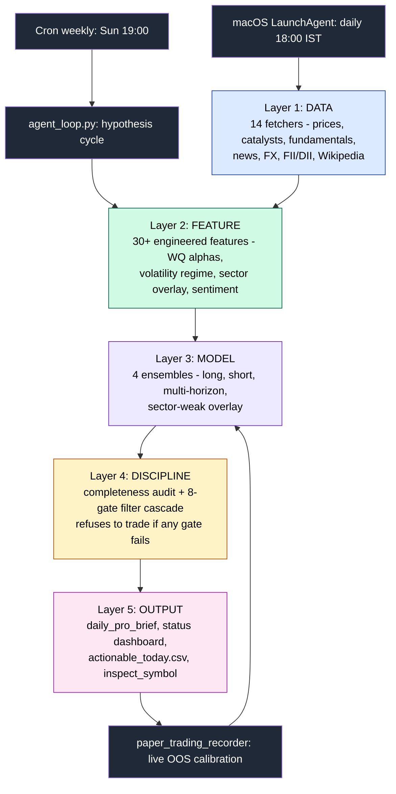
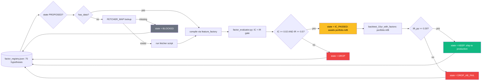
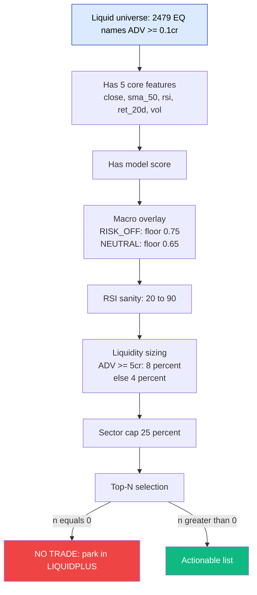

# Architecture

A 5-layer agentic trading system for the Indian (NSE) equity universe.
Built to produce honest, calibrated 7-day forward predictions with a
hard discipline gate that refuses to trade on low-conviction days.

## High-level topology — 5 layers

## Agent loop (weekly hypothesis cycle)

## Discipline cascade (the trade gate)

## File index (single source of truth)

| Layer | Files | Purpose |
|---|---|---|
| **Control** | `daily_pipeline.sh` · `com.zoom.daily-pipeline.plist` · `agent_loop.py` | Orchestration |
| **Data** | `refresh_prices.py` · `refresh_announcements.py` · `catalyst_tagger.py` · `build_catalyst_features.py` · `fetch_block_deals.py` · `fetch_news_rss.py` · `fetch_news_per_symbol.py` · `fetch_reddit.py` · `fetch_youtube.py` · `fetch_options_chain.py` · `fetch_fundamentals.py` · `fetch_forex_macro.py` · `fetch_fii_dii.py` · `fetch_wiki_pageviews.py` · `score_sentiment.py` | 15 ingesters |
| **Feature** | `feature_factory.py` · `factor_registry.py` · `factor_evaluator.py` · `compute_feature_importance.py` | Compile + evaluate alphas |
| **Model** | `run_v3_with_catalysts.py` · `run_short_side.py` · `run_multi_horizon.py` · `sector_weak_shorts.py` · `portfolio_sizer.py` | 4 ensembles + sizer |
| **Discipline** | `data_completeness.py` · `filter_cascade.py` · `paper_trading_recorder.py` | Gate enforcement + live calibration |
| **Output** | `generate_pro_brief.py` · `generate_daily_brief.py` · `inspect_symbol.py` · `build_workflow_diagram.py` · `build_status_dashboard.py` · `build_dashboard.py` · `build_html_viewer.py` | Reports + dashboards |
| **Backtest** | `backtest_10yr.py` · `backtest_10yr_with_factors.py` | Walk-forward validation |

Every file lives in `src/agentic/`. Total: ~28 Python scripts + 1 bash orchestrator + 1 plist.

## Honest performance — 10-year walk-forward

| Year | Mean 7d | Days >= +5% | Days < 0 |
|---:|---:|---:|---:|
| 2017 | +1.71% | 32% | 43% |
| 2018 | -0.22% | 21% | 55% |
| 2019 | -0.66% | 26% | 58% |
| 2020 | +3.86% | 45% | 36% |
| 2021 | +5.77% | 49% | 30% |
| 2022 | +1.58% | 29% | 43% |
| 2023 | +6.83% | 42% | 30% |
| 2024 | +0.13% | 29% | 48% |
| 2025 | +0.20% | 22% | 52% |
| **2016-2025** | **+2.18%** | **33%** | **44%** |

Realistic annualised ROI: **30-50% unlevered** (theoretical compound × 30% real-world capture).

## What this system is NOT

- Not a magic 4,000% machine. The original framing was wrong; honest forward expectation is 30-50% ann.
- Not survivable in 2018-style bear regimes without the discipline gate.
- Not validated on production v3's catalyst+sentiment lift — those need rigorous A/B (queued).
- Not real-time intraday — bhavcopy lands at ~5pm IST; brief runs at 18:00.
- Not for forced trades. **No-trade days exist and are mandatory.**
