# Workflow — daily pipeline (31 steps)

_Auto-generated by `build_workflow_diagram.py` at 2026-04-29 14:50_

## Diagram

```mermaid
flowchart TD
  start([18:00 IST kickoff])
  s0["1. refresh prices"]
  start --> s0
  s1["2. refresh announcements + insider"]
  s0 --> s1
  s2["3. tag announcements"]
  s1 --> s2
  s3["4. fetch block + bulk deals"]
  s2 --> s3
  s4["5. build catalyst features"]
  s3 --> s4
  s5["6. fetch news RSS"]
  s4 --> s5
  s6["7. fetch per-symbol Google News"]
  s5 --> s6
  s7["8. fetch broker recommendations"]
  s6 --> s7
  s8["9. fetch reddit"]
  s7 --> s8
  s9["10. fetch youtube"]
  s8 --> s9
  s10["11. score sentiment"]
  s9 --> s10
  s11["12. fetch options chain"]
  s10 --> s11
  s12["13. fetch fundamentals"]
  s11 --> s12
  s13["14. fetch macro time-series"]
  s12 --> s13
  s14["15. fetch FII/DII daily flows"]
  s13 --> s14
  s15["16. fetch Wikipedia pageviews"]
  s14 --> s15
  s16["17. retrain v3 ensemble"]
  s15 --> s16
  s17["18. retrain short-side model"]
  s16 --> s17
  s18["19. sector-weak short overlay"]
  s17 --> s18
  s19["20. retrain multi-horizon"]
  s18 --> s19
  s20["21. size portfolio"]
  s19 --> s20
  s21["22. record paper-trading picks"]
  s20 --> s21
  s22["23. data completeness audit"]
  s21 --> s22
  s23["24. filter cascade"]
  s22 --> s23
  s24["25. generate daily brief"]
  s23 --> s24
  s25["26. generate pro brief"]
  s24 --> s25
  s26["27. build workflow diagram"]
  s25 --> s26
  s27["28. build status dashboard"]
  s26 --> s27
  s28["29. build HTML visualizer"]
  s27 --> s28
  s29["30. compute feature importance"]
  s28 --> s29
  s30["31. build human dashboard"]
  s29 --> s30
  done([dashboard updated])
  s30 --> done

  style s0 fill:#1e3a5f,stroke:#fff,color:#fff
  style s1 fill:#1e3a5f,stroke:#fff,color:#fff
  style s2 fill:#1e3a5f,stroke:#fff,color:#fff
  style s3 fill:#1e3a5f,stroke:#fff,color:#fff
  style s4 fill:#1e3a5f,stroke:#fff,color:#fff
  style s5 fill:#1e3a5f,stroke:#fff,color:#fff
  style s6 fill:#1e3a5f,stroke:#fff,color:#fff
  style s7 fill:#1e3a5f,stroke:#fff,color:#fff
  style s8 fill:#1e3a5f,stroke:#fff,color:#fff
  style s9 fill:#1e3a5f,stroke:#fff,color:#fff
  style s10 fill:#1e3a5f,stroke:#fff,color:#fff
  style s11 fill:#1e3a5f,stroke:#fff,color:#fff
  style s12 fill:#1e3a5f,stroke:#fff,color:#fff
  style s13 fill:#1e3a5f,stroke:#fff,color:#fff
  style s14 fill:#1e3a5f,stroke:#fff,color:#fff
  style s15 fill:#1e3a5f,stroke:#fff,color:#fff
  style s16 fill:#3b1e5f,stroke:#fff,color:#fff
  style s17 fill:#3b1e5f,stroke:#fff,color:#fff
  style s18 fill:#3b1e5f,stroke:#fff,color:#fff
  style s19 fill:#3b1e5f,stroke:#fff,color:#fff
  style s20 fill:#3b1e5f,stroke:#fff,color:#fff
  style s21 fill:#5f4f1e,stroke:#fff,color:#fff
  style s22 fill:#5f4f1e,stroke:#fff,color:#fff
  style s23 fill:#5f4f1e,stroke:#fff,color:#fff
  style s24 fill:#1e5f2c,stroke:#fff,color:#fff
  style s25 fill:#1e5f2c,stroke:#fff,color:#fff
  style s26 fill:#1e3a5f,stroke:#fff,color:#fff
  style s27 fill:#1e3a5f,stroke:#fff,color:#fff
  style s28 fill:#1e3a5f,stroke:#fff,color:#fff
  style s29 fill:#1e3a5f,stroke:#fff,color:#fff
  style s30 fill:#1e3a5f,stroke:#fff,color:#fff
  style start fill:#000,color:#fff
  style done fill:#1e5f2c,color:#fff
```

## Legend

| Color | Stage | Purpose |
|---|---|---|
| 🟦1e3a5f | **DATA** | Data ingest — pulls fresh inputs from external sources |
| 🟦3b1e5f | **MODEL** | ML — retrains and scores against universe |
| 🟦5f4f1e | **GATE** | Discipline — completeness audit, cascade, paper-ledger |
| 🟦1e5f2c | **OUTPUT** | Brief — human-readable reports + actionable CSVs |

## Per-step inventory

| # | Step | Script | Group | What it produces |
|---|---|---|---|---|
| 1 | refresh prices (bhavcopy + features) | `refresh_prices` | DATA | `data/derived/stock_daily_facts_adjusted_2015plus.parquet` |
| 2 | refresh announcements + insider | `refresh_announcements` | DATA | `tmp/from_scratch_7d_run/alt/corp_announcements.parquet` |
| 3 | tag announcements | `catalyst_tagger` | DATA | `announcements_tagged.parquet` |
| 4 | fetch block + bulk deals | `fetch_block_deals` | DATA | `data/derived/block_deals.parquet, block_features.parquet` |
| 5 | build catalyst features | `build_catalyst_features` | DATA | `data/derived/catalyst_features.parquet` |
| 6 | fetch news RSS | `fetch_news_rss` | DATA | `data/derived/news_feed.parquet` |
| 7 | fetch per-symbol Google News (top-300+picks) | `fetch_news_per_symbol` | DATA | `appends to news_feed.parquet (per-symbol Google News)` |
| 8 | fetch broker recommendations (Moneycontrol/ET/BS) | `fetch_broker_recos` | DATA | `—` |
| 9 | fetch reddit | `fetch_reddit` | DATA | `data/derived/reddit_feed.parquet` |
| 10 | fetch youtube | `fetch_youtube` | DATA | `data/derived/youtube_videos.parquet` |
| 11 | score sentiment (news+reddit+yt, finance lexicon) | `score_sentiment` | DATA | `news_features.parquet, macro_sentiment.parquet` |
| 12 | fetch options chain (F&O IV/OI) | `fetch_options_chain` | DATA | `options_chain_snapshot.parquet (IP-blocked)` |
| 13 | fetch fundamentals (NSE top-500) | `fetch_fundamentals` | DATA | `data/derived/fundamentals_snapshot.parquet` |
| 14 | fetch macro time-series (USDINR/EUR/GBP/JPY via Frankfurter) | `fetch_forex_macro` | DATA | `data/derived/macro_timeseries.parquet` |
| 15 | fetch FII/DII daily flows (NSE) | `fetch_fii_dii` | DATA | `data/derived/fii_dii_flows.parquet` |
| 16 | fetch Wikipedia pageviews (retail attention proxy) | `fetch_wiki_pageviews` | DATA | `data/derived/wiki_pageviews.parquet` |
| 17 | retrain v3 ensemble (long, 7d) | `run_v3_with_catalysts` | MODEL | `v3_live_top100.csv, v3_live_full.csv, v3_oof.parquet` |
| 18 | retrain short-side model | `run_short_side` | MODEL | `short_live_top100.csv, short_live_full.csv` |
| 19 | sector-weak short overlay (large-cap rotation) | `sector_weak_shorts` | MODEL | `sector_weak_shorts.csv (macro overlay)` |
| 20 | retrain multi-horizon (1d/7d/21d) | `run_multi_horizon` | MODEL | `multi_horizon_top.csv (1d/7d/21d triangulation)` |
| 21 | size portfolio (Kelly + regime) | `portfolio_sizer` | MODEL | `portfolio_today.csv` |
| 22 | record paper-trading picks | `paper_trading_recorder` | GATE | `data/derived/paper_trading_ledger.parquet` |
| 23 | data completeness audit (the gate) | `data_completeness` | GATE | `reports/data_completeness_*.md, completeness.parquet` |
| 24 | filter cascade (discipline layer) | `filter_cascade` | GATE | `actionable_today.csv + filter_cascade_*.md` |
| 25 | generate daily brief | `generate_daily_brief` | OUTPUT | `reports/daily_brief_*.md` |
| 26 | generate pro brief (Bull/Base/Bear) | `generate_pro_brief` | OUTPUT | `reports/daily_pro_brief_*.md` |
| 27 | build workflow diagram | `build_workflow_diagram` | DATA | `—` |
| 28 | build status dashboard | `build_status_dashboard` | DATA | `—` |
| 29 | build HTML visualizer (developer) | `build_html_viewer` | DATA | `—` |
| 30 | compute feature importance | `compute_feature_importance` | DATA | `—` |
| 31 | build human dashboard (user) | `build_dashboard` | DATA | `—` |

## Workflow control plane

- Kickoff: macOS LaunchAgent `com.zoom.daily-pipeline` at 18:00 IST
  → runs [`src/agentic/daily_pipeline.sh`](../src/agentic/daily_pipeline.sh)
- Status: [`status.md`](status.md) regenerates after every run
- Logs: `logs/daily_pipeline_<YYYYMMDD_HHMM>.log`
- Brief: `reports/daily_pro_brief_<YYYYMMDD>.md`
- This file: `reports/WORKFLOW.md` (re-render with `python src/agentic/build_workflow_diagram.py`)

## Background processes (not part of the daily pipeline)

These run on demand or as long-running jobs:

- `factor_evaluator.py` — measures lift of new factors against OOS forward returns
- `feature_factory.py` — compiles WorldQuant-style alphas + macro-conditional features
- `factor_registry.py` — the hypothesis catalog with KEEP/DROP verdicts